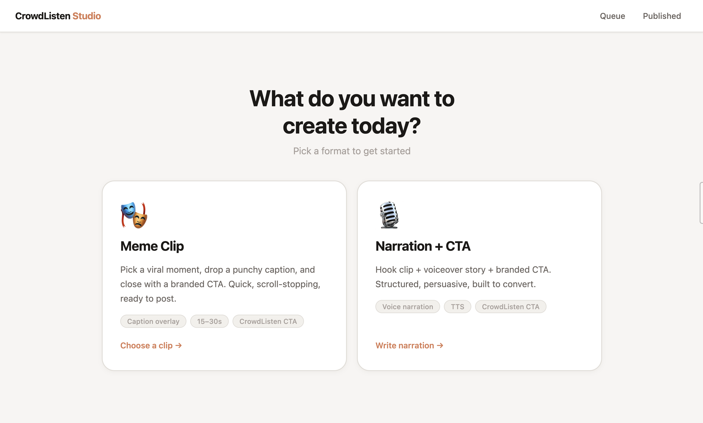
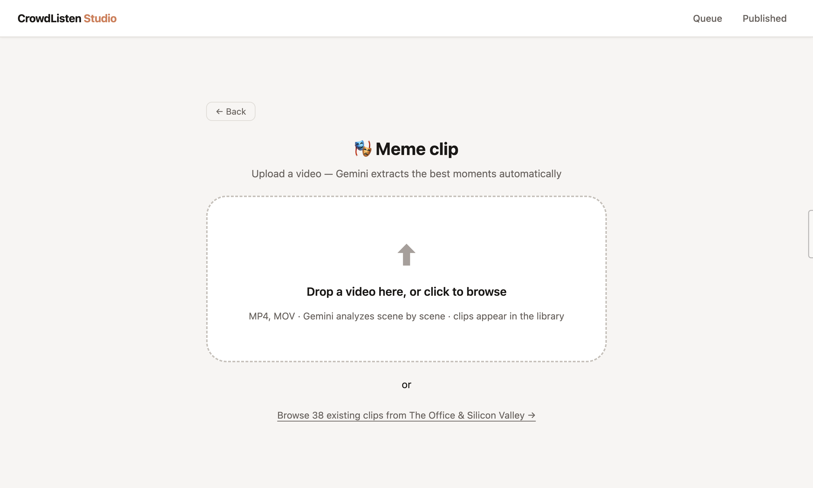
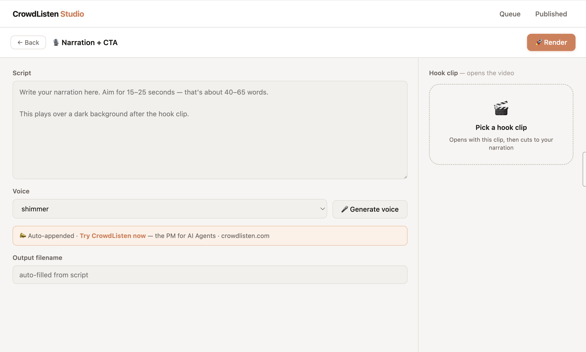

# CrowdListen Marketing — Meme Reels System

Short-form video content for TikTok + Instagram. AI/PM/Eng audience.

---

## How This Works

This is a two-interface system. You can drive it visually (Studio web app) or conversationally (OpenClaw AI agent). Both talk to the same files and the same rendering pipeline.

```
You (chat or browser)
        │
        ├── OpenClaw (AI agent)          ← chat via Signal/Telegram/web
        │     │  talks to you in natural language
        │     │  reads/writes files, starts jobs, monitors status
        │     │
        └── Studio (web app)             ← open in browser at localhost:8000
              │  visual clip browser, caption editor, queue + review
              │
              ▼
        Studio API (FastAPI, port 8000)
              │
        ┌─────┴──────────────┐
        │                    │
   Clip library          Render pipeline
   (Gemini JSON)         (ffmpeg)
        │                    │
   38 pre-analyzed       studio/review/     ← approve/reject here
   moments from          studio/published/  ← final clips
   Office + SV 1–3
```

### The pipeline, step by step

**1. Source video** → drop an `.mp4` into `marketing_clips/`

**2. Gemini analysis** → the Studio (or `scripts/analyze_video.py`) uploads the video to Gemini, which watches it and returns timestamped "meme moments" ranked by energy score. Output: `processing/*_visual_analysis.json`

**3. Clip library** → the Studio reads those JSON files and shows 38 browsable clips with scores, captions, and visual descriptions. No re-analyzing needed unless you add a new source video.

**4. Create** → pick a clip in Studio (or tell OpenClaw what you want), write a caption, choose Meme or Narration mode → hit Render

**5. Render** → ffmpeg cuts the clip, burns in the caption, appends the branded CTA card. For Narration, it also runs TTS and assembles hook + voiceover + CTA. Output: `studio/review/`

**6. Review → Publish** → Studio's Published tab shows all clips for approval. Approve → moves to `published/`. That's your posting queue.

---

## OpenClaw Integration

**OpenClaw** (#1, the AI agent) runs on your machine and treats the Studio as its content library and workflow engine.

### The mental model

```
Studio GUI                        OpenClaw (LUI)
──────────────────────────────    ────────────────────────────────
Visual clip library               "Make a clip about scope creep"
Workflow SOP (meme / narration)   Searches library, picks best match
Content display (published/)      Queues render via /api/batch
Review + approve                  Monitors queue, notifies when ready
Sync button (⟳)                   Can run entire pipeline unattended
```

**Studio = the SOP.** It defines the two workflows, the clip library, the caption rules, the CTA config. OpenClaw reads and executes that SOP.

**OpenClaw = the operator.** It can pick clips by topic, run batch renders, check what's published, and report status — all from a chat message.

### What OpenClaw can do right now

```
"What clips do we have about AI agents?"
→ searches library, returns top 3 with scores + captions

"Make a clip about scope creep"
→ picks best match, queues render, notifies when done

"Make a week of content"
→ picks 5 clips, POST /api/batch, monitors queue

"What's ready to post?"
→ checks /api/published and /api/review, gives a summary

"Sync the library"
→ POST /api/sync — reloads clips from disk instantly
```

### What's coming next

- Auto-post to TikTok/Instagram via their APIs
- Content calendar — OpenClaw schedules and queues automatically
- Analytics loop — track performance, feed back into clip selection

Full API reference for OpenClaw → `STUDIO.md` in the workspace.

---

## Studio — Visual Video Editor

A local web app for creating meme clips and narration videos without touching the CLI.

**Start it:**
```bash
cd studio && ./start.sh
# → http://localhost:8000
```

### Landing — pick your format



Two modes: **Meme Clip** (caption overlay + branded CTA) or **Narration + CTA** (hook clip + voiceover + call to action).

### Clip Browser — pick the moment



38 clips pre-analyzed by Gemini from The Office + Silicon Valley 1–3. Filter by source, score threshold. Or upload a new video and Gemini extracts the best moments automatically.

### Composer — write the caption and render



Caption auto-filled from Gemini's analysis. Edit, rename, hit Render → clip lands in the Queue tab for review.

---

## Folder Structure

```
crowdlisten_marketing/
│
├── marketing_clips/        SOURCE — raw input videos (drop new ones here)
│   ├── The Office Best Scenes.mp4
│   ├── siliconvalley1.mp4
│   ├── siliconvalley2.mp4
│   └── siliconvalley3.mp4
│
├── processing/             INTERMEDIATE — auto-generated, don't edit by hand
│   ├── *_transcript.json       Whisper audio transcripts
│   └── *_visual_analysis.json  Gemini visual scene analysis
│
├── reels_output/           RENDERS — versioned work-in-progress (keep all versions)
│   ├── v1/ … v5/               archived batches
│   └── v6/                     current render batch
│
├── published/              FINAL — ready-to-post clips (copy best from reels_output/)
│   └── *.mp4                   11 clips from v6 (current best)
│
└── scripts/                TOOLS
    ├── analyze_video.py    step 1: visual analysis via Gemini
    ├── render_reels.py     step 2: render clips with text overlay
    └── clip_rationale.md   why each clip works + audience notes
```

---

## Workflow — Adding New Source Video

### Step 1 — Drop video in `marketing_clips/`

### Step 2 — Analyze (visual + audio)
```bash
cd crowdlisten_marketing

# Visual analysis via Gemini (watches the video, returns timestamped meme moments)
python3 scripts/analyze_video.py marketing_clips/YOUR_VIDEO.mp4

# Audio transcript via Whisper (if video > 25MB, extract audio first)
ffmpeg -y -i marketing_clips/YOUR_VIDEO.mp4 -vn -ar 16000 -ac 1 -b:a 32k processing/YOUR_VIDEO_audio.mp3
curl -sS https://api.openai.com/v1/audio/transcriptions \
  -H "Authorization: Bearer $OPENAI_API_KEY" \
  -F "file=@processing/YOUR_VIDEO_audio.mp3" \
  -F "model=whisper-1" -F "response_format=verbose_json" -F "language=en" \
  -o processing/YOUR_VIDEO_transcript.json
```

### Step 3 — Pick clips
Open `processing/YOUR_VIDEO_visual_analysis.json` — Gemini has already ranked scenes
by meme score with visual descriptions. Cross-reference with the transcript for dialogue.

**What to look for:**
- Scene ENERGY matches a PM/Eng/AI scenario (don't just match words)
- 8–15 second clips (sweet spot)
- Physical comedy, reaction shots, visual props — these only show in visual analysis

### Step 4 — Edit `scripts/render_reels.py`
```python
VERSION = "v7"   # ← bump from v6

CLIPS = [
    (
        "descriptive_filename_for_the_clip",
        SOURCE_FILE, START_SECONDS, DURATION_SECONDS,
        "caption line 1\ncaption line 2",
    ),
    # ...
]
```

**Caption rules:**
- 2 lines max, ~26 chars per line
- Match scene energy, not transcript words
- Specific > generic ("Cursor write access to main" not "using AI tools")
- Sounds like a confession or a relatable callout
- Use `\n` for line breaks; use curly quotes `'` not straight `'`

### Step 5 — Render
```bash
python3 scripts/render_reels.py
# → clips appear in reels_output/v7/
```

### Step 6 — Publish
Review clips in `reels_output/v7/`. Copy the ones that are ready to post:
```bash
cp reels_output/v7/CLIP_NAME.mp4 published/
```
`published/` = the single source of truth for what's ready to post.

---

## What's In The Library

38 clips total from The Office + Silicon Valley 1–3 — all analyzed by Gemini. Browse and filter by score in the Studio. Published clips live in `published/` and are visible in the Studio Published tab, grouped by batch.

For current clip details, open the Studio → clip browser. Source of truth is there, not this file.
